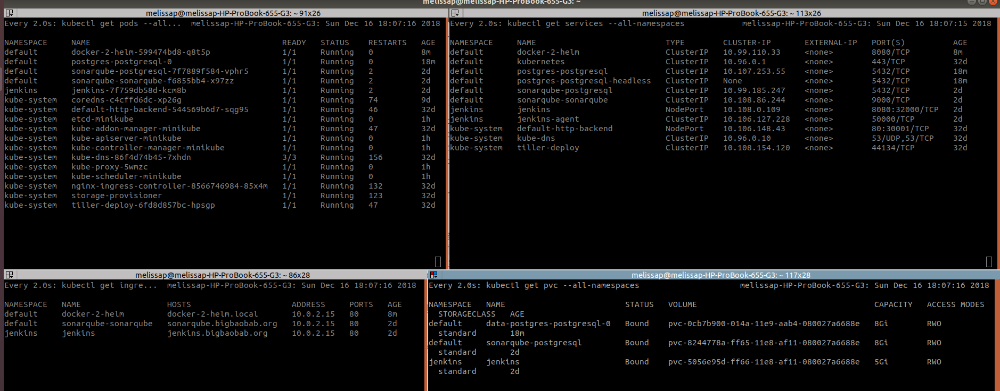

# Deploying a Spring Boot app to K8s

In this post I create a greeting RESTFul API with Spring, that queries a DB for its hello strings. Use Docker to create an image and run it in a container. I'll cover how to use docker compose to run multiple containers for the application (our app, and postgres DB). Finally deploying the app to a K8s cluster using Helm package manager.

Thank you to **The Practical Developer** as is post at: https://thepracticaldeveloper.com/2017/12/11/dockerize-spring-boot/ allot of this is based off of what he taught is there. 

**I go through the following core technology stack, during this post:**

- [Spring](https://spring.io/) is an application framework and inversion of control container for the Java platform.
- [Docker](https://www.docker.com/)  is the container technology that allows you to containerise your applications.
- [Docker Compose](https://docs.docker.com/compose/) is a tool for defining and running multi-container applications. 
- [Kubernetes](https://kubernetes.io/) (commonly known as K8s) is an open-source container-orchestration system for automating deployment, scaling and management of containerised applications.
- [Helm](https://docs.helm.sh/) is a package manager for K8s, it simplifies the installation of an application and its dependencies into a K8s cluster.

# 01-Create a Spring Boot Rest API

For this step, I have assumed prior knowledge of Spring Boot, Maven and creating Restful APIs. If not checkout the following Spring.io guides: [Building a RESTful Web Service](https://spring.io/guides/gs/rest-service/), [Building REST services with Spring](https://spring.io/guides/tutorials/bookmarks/), [Accessing JPA Data with REST](https://spring.io/guides/gs/accessing-data-rest/)

You can also grab the code in my repo, on the 01-springboot-app branch in [GitHub](https://github.com/melissapalmer/basic-java-app-2-helm/tree/01-springboot-app)

**This application includes:** 

- An endpoint `/hello` that'll respond with various greetings text sourced from a DB. 
- Spring Actuator: which exposes health check endpoints, that will be used later on

**Few things to notice**

- application.yml includes the setting `spring.datasource.platform=h2` Spring in turn knows to use the  `data-h2.sql` file to initialise the h2 DB on start up. 
- I have done this so that later, we can initialise the 'real' DB in other ways. It will help see how a 'real' DB is used vs. the H2 in memory DB.

**Compiling and Running the app** 

- Build Using `./mvnw clean package`
- Run Using `java -jar target/docker-2-helm.jar` or `./mvnw spring-boot:run`

Go to http://localhost:8080/hello to see a hello message. 
Also test out the Spring Actuator endpoints: http://localhost:8080/actuator and http://localhost:8080/actuator/health

**So far we have done nothing with Docker**, however it is important to understand, that we've: 

- only built and run the application locally: **using a pre-installed version** of Java &/or Maven. 
- If we were to hand this over to the an OP's team at this point: 
  - we'd need to specify to them what version of Java is needed

# **02-Containerise It** 

This step takes the Spring Boot application and creates a Docker image. You'll need to ensure you have Docker installed.

## Prerequisites

- [Docker](https://docs.docker.com/v17.09/engine/installation/linux/docker-ce/ubuntu/)		Install Instructions: `sudo apt install docker`

Create a Dockerfile, as below, in your project. This is used to define an image, build it and run it using Docker commands.

```dockerfile
# Step : Build image
FROM maven:3.5.3-jdk-8-alpine as BUILD
WORKDIR /build
COPY pom.xml .
# get all the downloads out of the way
# mvn <maven-plugin-name>:help caches maven specific dependencies to image
# mvn dependency:go-offline caches build depencencies to image
RUN mvn clean
RUN mvn compiler:help jar:help resources:help surefire:help clean:help install:help deploy:help site:help dependency:help javadoc:help spring-boot:help
RUN mvn dependency:go-offline
COPY src/ /build/src/
RUN mvn package

# Step : Package image
FROM openjdk:8-jre-alpine as APP
EXPOSE 8080
COPY --from=BUILD /build/target/docker-2-helm.jar app.jar
#To reduce Tomcat startup time we added a system property pointing to "/dev/urandom" as a source of entropy.
ENTRYPOINT ["java","-Djava.security.egd=file:/dev/./urandom","-jar","/app.jar"]
```

**Describe Docker File**

I'm using a multi-stage Dockerfile here, Docker's multi-stage feature allows a Dockerfile to contain more than one FROM line. Each stage starts with a new FROM line and a fresh context.

In this case there are two FROM instructions. This means this is a two-stage build.

- `FROM` command tells docker which base image to start building your own image off
  - You therefore get all the installs from the base layer image)
- The `maven:3.5.3-jdk-8-alpine` stage is the base image for the first build, it is named BUILD. And is used to build a fat jar for the application. 
  - the other advantage of the multi-stage build is that if nothing has changed for a stage, it won't be generated again. 
  - i.e.: if you pom.xml has not changed this step will not run again and therefore the maven dependencies wont be downloaded over and over. 
- The `RUN` commands  get the maven dependencies downloaded to the docker image
- The second`FROM openjdk:8-jre-alpine` is the final base image for the build. The jar file generated in the first stage is copied to this stage using `COPY --from=BUILD`
- `EXPOSE` instruction tells Docker port 8080 port can be exposed outside the container.
- `COPY --from=BUILD` copies the jar from previous BUILD image layer to app.jar on our final image. 
- `ENTRYPOINT` is the command run on the container when it first starts up. As this is Java app, packaged as a jar. We run the java command `java-jar app.jar`

**Build Docker image and Run it**

- Build the Docker image `docker build -t melissapalmer/docker2helm:latest .` 
  - which will make it available in your local Docker registry.
  - `-t` flag gives the image a name
  - the last parameter `.` specifys the directory to fine the Dockerfile (in this case the current directory)
- You can list the available images in your local docker registry using:  `docker images`
- To now create a container using this image, run the command `docker run -d -p 8080:8080 -t melissapalmer/docker2helm`
  - `-p` flag tells docker to expose the container’s port 8080 (on the right of the colon) on the host’s port 8080 (on the left, our machine). 
- See running Docker container `docker ps`
- Checkout the logs at `docker logs -f <container_id>`
- Stop/Remove container `sudo docker rm <container_id> --force`

Again go to http://localhost:8080/hello to see a hello message, note that the IP address will be different. This is because it is now coming from an application deployed inside a docker container. (Each container gets its own, new IP assigned inside the Docker network.)

**AT THIS POINT: .... We have a Spring Boot app running in a Docker container.** NOTE: the differences from the previous step:

- We used Docker (and not your own machine) to build the application jar (ie: stage one of our multi-stage Dockerfile)
- We ran the container using docker commands
- Handing this over to OP's would require they have Docker and know the docker commands. We have specified the dependencies to build and run our application in the Dockerfile

# 03-Running our app with linked DB (using Docker Compose)

Docker Compose is a tool to run multiple containers, define how they are connected, how many instances should be deployed, etc. In this scenario we want to replace the in memory DB, with a working postgresql DB (another container). 

## Prerequisites

**Docker Compose:** 1.17.1		Install Instructions: `sudo apt install docker-compose`

- Docker

Create a  `docker-compose.yml` as below:

```
version: '3.1'

volumes:
  init.sql: 
  data:
  postgres_data:
    driver: local
  application-container.yml: 

services:
  db:
    image: postgres:9.6.9
    volumes:
    - postgres_data:/var/lib/postgresql/data 
    - ./docker/init.sql:/docker-entrypoint-initdb.d/init.sql
    ports:
    - "5433:5432"
    environment:
    - POSTGRES_PASSWORD=example
    - POSTGRES_DB=db
    
  adminer:
    image: adminer
    restart: always
    ports:
    - 8081:8080
    
  docker2helm:
    image: melissapalmer/docker2helm
    volumes:
    - ./application-container.yml:/config/application.yml
    restart: always
    ports:
    - 8080:8080
    links:
      - db
    depends_on:
      - db
```

**Describe docker-compose.yml file**

- in this file we have described 3 services: docker2helm (our app), db (the postgres DB for our our), adminer (is a DB management tool, helps us to easily login and see the DB)
- the **db** service is marked as a `postgres:9.6.9` we set the password via environment variables
  - and pass in an initialisation script (init.sql) 
  - remember in the previous step we used Spring to initialise the DB using `data-h2.sql` file and `spring.datasource.platform=h2` setting
- for the **docker2helm** service (which is our spring app as a docker image)
  - we overwrite the application.yml by copying over ./application-container.yml to /config/application.yml in this we have the `spring.datasource.platform=postges` it'll therefore ignore the data-h2.sql file
  - we could have done this with Spring profiles, but I wanted to show volume in Docker too. 
  - remember that spring will pickup and config files from config/ folder by def

**Run our app and the Postgresql container**

- `sudo docker-compose -f docker-compose.yml up`
  - make sure you have build your own image before running the above i.e: `docker build -t melissapalmer/docker2helm:latest .`

Again go to http://localhost:8080/hello to see a hello message, note that the IP address will be different. And your will see the message strings include 'from PG' indicating that we are querying from the postgres DB in docker network and not the h2 in memory DB.

You can also checkout adminer at: http://localhost:8081/

To cleanup and stop all containers created by the above you can run 

- `docker-compose down` to stop all the containers
- this does not remove any volumes, to do so you would need to run `docker system prune --volumes`

**AT THIS POINT: .... we have now** 

- Run our application and dependant applications using docker-compose
- however docker-compose only runs the containers on one host. If larger production environment this may not be sufficient. 

# 04-k8s & helm

Using docker-compose you can scale up and run multiple container instances of the same image. *However*: these containers are all started on the **same** host. Whereas kubenetes is a container orchestration tool for running and connecting containers on **multiple** hosts. In this next step I run my Spring Boot app in a container on K8s cluster, using Minikube. 

K8s has some great getting started tutorials at: https://kubernetes.io/docs/user-journeys/users/application-developer/foundational/ 

## Prerequisites

**Minikube**: v0.30.0		Install Instructions at: https://github.com/kubernetes/minikube
**VitualBox:** 				Install Instructions at: https://www.virtualbox.org/wiki/Linux_Downloads
**Helm:** v2.11.0			Install Instructions at: https://docs.helm.sh/using_helm/#installing-helm
**Kubectl**: v1.10.0			Install Instructions at: https://kubernetes.io/docs/tasks/tools/install-kubectl/

**minikube**: is a tool that makes it easy to run Kubernetes locally.
**kubectl**: is a command line tool for communicating with the k8s API server. 


First we need to get a K8s cluster running, do this by running the following command: 
​	`minikube start --cpus 4 --memory 8192`
this starts a VM on VirtualBox with 4 CPUs and 8GB memory and will run "a simple, single-node k8s cluster. This cluster is fully functioning and contains all core Kubernetes components." Minikube also includes a Docker on this VM. 

To watch what is happening on the k8s cluster, use the following commands. 

- `watch kubectl get pods`
- `watch kubectl get ingresses`
- `watch kubectl get services`
- `watch kubectl get pvc`

I use Terminator  terminal emulators which allows multiple terminals in one window, as below: 

​	to install Teminator 	`sudo apt-get install terminator`




Helm has two parts, a client, helm, and a server, tiller. To install Tiller onto your k8s cluster you need to run
​	`helm init`

**Remember when we used the docker-compose above, we included a Postgres DB.** 

We want to get a postgres DB running in our k8s cluster. Helm already has a postgres chart that we can use.. and setup to our own needs by overriding settings applicable to us. The repo for Helm Stable charts is at: https://github.com/helm/charts/tree/master/stable/postgresql 

Within the repo under the scripts folder, i have created install scripts for this helm chart. Basically what they are doing is: 

- I took a copy of the values.yml from the above mentioned repo. and customised it so that I could set the values for: postgresqlUsername, postgresqlPassword and postgresqlDatabase as well as the initdbScripts
- FYI: at the time of writing this there were a couple issues with the Helm Chart initdbScripts field. And you have to include the script within values file is could not be in its own file. 
- So that we can see the data coming from this postgres instance on the k8s cluster, I initialised the DB with the following: 

```yaml
initdbScripts:
  db-init.sql: |
    create sequence hibernate_sequence start with 1 increment by 1;
    create table greeting (id bigint not null, say varchar(255), primary key (id));
    insert into greeting(id,say) values(1,'Hello from Helm PG');
    insert into greeting(id,say) values(2,'Hi from Helm PG');
    insert into greeting(id,say) values(3,'Howdy! from Helm PG');
    insert into greeting(id,say) values(4,'Howdy, Howdy! from Helm PG');
```

**To install the postgres Helm Chart you can run::**

​	`helm install --name postgres --replace -f postgres-values.yaml stable/postgresql`

this installs the chart, giving it a name of postgres and replacing the values with our values from postgres-values.yaml

To log into this database and see our greeting table used the command suggested by the helm chart output: 

`export POSTGRESQL_PASSWORD=$(kubectl get secret --namespace default postgres-postgresql -o jsonpath="{.data.postgresql-password}" | base64 --decode)`

and then 

`kubectl run postgres-postgresql-client --rm --tty -i --restart='Never' --namespace default --image bitnami/postgresql --env="PGPASSWORD=$POSTGRESQL_PASSWORD" --command -- psql --host postgres-postgresql -U postgresHelm -d postgresHelmDB`

You'll be logged into the DB and can run commands like: 

`select * from greeting;`

**Now we can create a helm chart for our application by running:** 
​	`helm create docker-2-helm`
this will create a basic example chart for us that will need to be customised for our application. 

```
docker-2-helm
-- templates
	-- deployment.yaml
	-- _helpers.tpl
	-- ingress.yaml
	-- NOTES.txt
	-- service.yaml
-- Chart.yaml
-- values.yaml
```

Each file under the templates folder maps to a component within k8s and is templated out using Go Templates. The values.yaml file is used to specify all config parameters that can be used against this charts templates. Usually people also a README.md to their chart folder which includes details on these settings and how to use them. 

You now have to customise this chart for your own application, start with the values.yaml

- match the repository image settings to your own image we have been creating
- enable the ingress (so that we can get to our app from the host machine), set reasonable host for: `chart-example.local`
- and include any config which will be specific to your own application

Below is the values.yaml for my application (I've only included those attributes I changed, for full version check on my GitHub repo):

```
image:
  repository: melissapalmer/docker2helm
  tag: latest
  pullPolicy: IfNotPresent
  
service:
  type: ClusterIP
  port: 8080

ingress:
  enabled: true
  annotations: {}
    # kubernetes.io/ingress.class: nginx
    # kubernetes.io/tls-acme: "true"
  path: /
  hosts:
    - docker-2-helm.local

#Spring related config for my own application, to pass through via helm chart
configuration:
  spring:
    datasource:
      url: jdbc:postgresql://postgres-postgresql:5432/postgresHelmDB
      username: postgresHelm
      password: postgresHelm
      platform: postgresql
    jpa:
      showsql: true
      generateddl: false
      hibernateddlauto: validate
```

We want to mount our own config to the Spring Boot container. To do this we need to change the `deployment.yaml` to include a mounted volume for our config. First create a configuration.yaml file in the templates folder with the following::

```yaml
apiVersion: v1
kind: ConfigMap
metadata:
  name: {{ template "docker-2-helm.fullname" . }}-configmap
  labels:
    heritage: {{ .Release.Service }}
    release: {{ .Release.Name }}
    chart: {{ .Chart.Name }}-{{ .Chart.Version }}
    app: {{ template "docker-2-helm.fullname" . }}
data: 
  application.yml: |-
    spring:
      datasource:
        url: {{ .Values.configuration.spring.datasource.url }}
        username: {{ .Values.configuration.spring.datasource.username }}
        password: {{ .Values.configuration.spring.datasource.password }}
        platform: {{ .Values.configuration.spring.datasource.platform }}
      jpa:
        show-sql: {{ .Values.configuration.spring.jpa.showsql }}
        generate-ddl: {{ .Values.configuration.spring.jpa.generateddl }}
        hibernate.ddl-auto: {{ .Values.configuration.spring.jpa.hibernateddlauto }}
```

This creates a ConfigMap for k8s, and pushes in our application.yml that will later be used by our Spring Boot application. See the `.Values.configuration.spring.datasource.url` is matching the values.yaml where we added our Spring related settings. 

Customised the `deployment.yaml` to include this ConfiMap as a volumeMounts and volumes as below: (again not the full file see GitHub repo for this)

```yaml
...       
          volumeMounts:
          - name: configuration-volume
            # Note: 'app.jar' currently resides within the root folder.
            mountPath: /config
...
	  volumes:
      - name: configuration-volume
        configMap:
          name: {{ template "docker-2-helm.fullname" . }}-configmap
```


**Now to actually run this Helm Chart and use the URLs of our application you need to do the following:** 

- include a host entry in your hosts file (edit /etc/hosts) for `docker-2-helm.local` the name given to the k8s ingress to your application in the values.yaml of helm chart
  - The IP for this host, is the IP of your minikube cluster. To get this run `minikube ip`
- Install your app, via helm to the k8s cluster using from the root directory
  - `helm install --name docker-2-helm ./helm-chart/docker-2-helm`


**Now go to** http://docker-2-helm.local/hello to see a hello message, note that the IP address will be different. And your will see the message strings include 'from Helm PG' indicating that we are querying from the postgres DB on k8s cluster and not the h2 in memory DB.

We cannot use localhost anymore as the container is running inside of our k8s cluster. Which has an ingress to expose the container. 

# 05-helm parent chart

Above we ran two separate helm charts, using two different commands. One of the features of Helm is to be able to specify the dependant applications: 

**To do this** (an example is under the helm-chart/docker-2-helm-full/ folder in my GitHub repo)

- Add a `requirements.yaml` which includes a list of dependencies as follows: 

  ```yaml
  dependencies:
    - name: postgresql
      version: 3.1.3
      repository:  "@stable"
  ```

Then include the postgresql chart values into your own values.yaml file: under the postgresql flag eg: 

```yaml
#override settings for the postgresql chart
postgresql:
  postgresqlUsername: postgresHelm
  postgresqlPassword: postgresHelm
  postgresqlDatabase: postgresHelmDB
  initdbScripts:
    db-init.sql: |
      create sequence hibernate_sequence start with 1 increment by 1;
      create table greeting (id bigint not null, say varchar(255), primary key (id));
      insert into greeting(id,say) values(1,'Hello from parent Helm PG');
      insert into greeting(id,say) values(2,'Hi from parent Helm PG');
      insert into greeting(id,say) values(3,'Howdy! from parent Helm PG');
      insert into greeting(id,say) values(4,'Howdy, Howdy! from parent Helm PG');
```

I also updated the chart a little: Instead of "hard-coding" the host name for DB URL for our app. I defined a variable in helm chart _helpers.tpl for the postgres setting

```go
{{- define "postgresql.hostname" -}}
{{- printf "%s-%s" .Release.Name "postgresql" | trunc 63 | trimSuffix "-" -}}
{{- end -}}
```

Then in the configuration.yaml we can use this template value as follows:

```go
url: "jdbc:postgresql://{{ template "postgresql.hostname" . }}:{{- .Values.postgresql.service.port -}}/{{- .Values.postgresql.postgresqlDatabase -}}"
```

**To install this chart**

- You will first need to run `helm dependency update ./helm-chart/docker-2-helm-full/`
- Then you can install the chart using `helm install --name docker-2-helm ./helm-chart/docker-2-helm-full/`


**As usual, the source code for this blog is on** [GitHub](https://github.com/melissapalmer/basic-java-app-2-helm)

# References

- [Spring Boot with Docker](https://spring.io/guides/gs/spring-boot-docker/) from Spring.io
- [Dockerize a Spring Boot application](https://thepracticaldeveloper.com/2017/12/11/dockerize-spring-boot/) from The Practical Developer
- [Building thin Docker images using multi-stage build for your java apps!](https://aboullaite.me/multi-stage-docker-java/) from Mohammed Aboullaite
- [What's the difference between docker compose and kubernetes?](https://stackoverflow.com/questions/47536536/whats-the-difference-between-docker-compose-and-kubernetes) from Stackoverflow